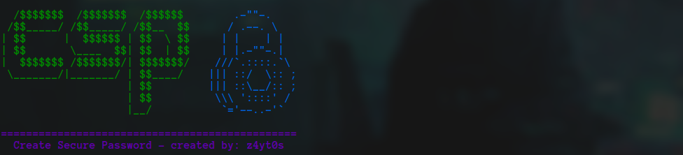
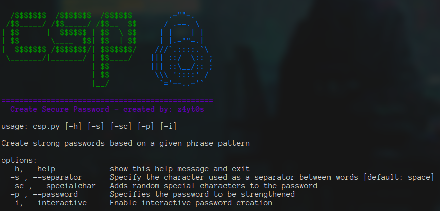
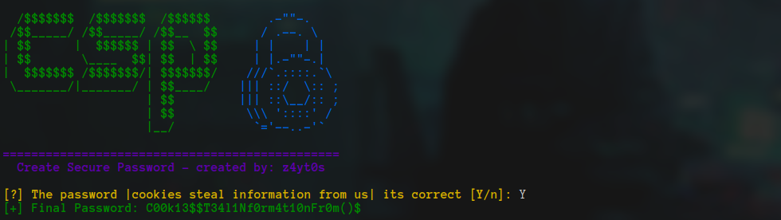
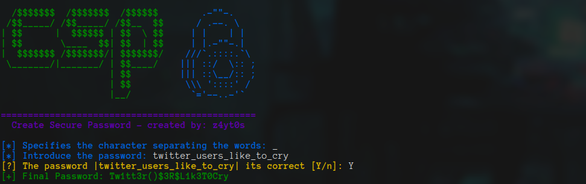

# Crear Contraseñas Seguras - CSP



Recordar contraseñas puede resultar complicado, especialmente al cumplir con las medidas recomendadas, como tener una cuenta nueva para cada servicio, contraseñas distintas, una longitud adecuada, caracteres especiales, números, mayúsculas y minúsculas, entre otros requisitos.

En la actualidad, la necesidad de crear cuentas para diversos propósitos hace prácticamente imposible recordar todas estas contraseñas. Las soluciones convencionales, como el uso de un administrador de contraseñas (que a menudo implica una suscripción de pago) o apuntarlas en una libreta, son válidas pero pueden no resultar ideales.

Personalmente, estas opciones no parecen ser las mejores alternativas. ¿Y si solo necesitáramos recordar una frase relacionada con la cuenta y luego fortalecerla para crear una contraseña sólida y fácil de recordar?

Es con esta premisa que nace el proyecto Create Secure Password (CCS). Ofrece una nueva perspectiva para la creación y gestión de contraseñas, permitiéndote recordar una única frase y transformarla en contraseñas robustas para cada cuenta. 

## Lógica De La Creación De contraseñas

Imaginemos que tengamos que crear una cuenta en cualquier plataforma, como GitHub. El primer paso sería crear una frase que nos recuerde fácilmente a este sitio, puede ser un comentario gracioso, una referencia al servicio que ofrece, etc. El caso es que sea una frase que tú dirías.

Posteriormente tendrías que fortificar esa frase creándole una serie de normas, poner palabras en mayúsculas, utilizar signos, números, etc. En mi caso, mi lógica me lleva a este pensamiento:

github promotes open source software more or less -> G1th()bPr0m0t3$0P3n$0()Rc3$0Ftw4r3M0r30RL3$$

Lo que hacemos es que a algunas letras les añadimos una asociación a un número o a un carácter, además de hacer que cada palabra de la frase tenga una mayúscula, cumpliendo con los requisitos de complejidad.

Ahora lo que podemos hacer es almacenar simplemente las frases y realizarles esta conversión, las frases por sí solas no tienen sentido y si alguien las leyería, pensarían que simplemente estás loco.

Es cierto que es muy tedioso hacer esto manualmente, pero CSP lo hará por ti =)

## Uso De La Herramienta

Create Secure Password (CSP) es una herramienta de línea de comandos diseñada para convertir frases en contraseñas. Aunque esta herramienta está enfocada para usuarios que saben utilizar una línea de comandos a nivel básico, también implementa una forma interactiva que facilita la creación y ofrece una experiencia amigable para el usuario.

### Arguments Mode

En el caso de que queramos agilizar el proceso de creación de la contraseña podemos utilizar los argumentos predefinidos, para verlos simplemente tendremos que ejecutar el comando con el flag --help o no indicar ningún argumento.
``` bash
csp --help
```


Ejemplo de uso:

``` bash
csp -p 'cookies steal information from us' -s ' '
```


### Interactive Mode

Podemos habilitar el modo interactivo utilizando el argumento '-i' a la hora de ejecutar la herramienta. Ej:
``` bash
csp -i
```

